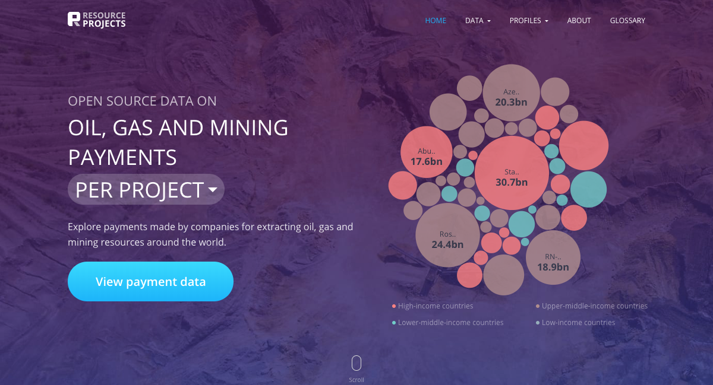
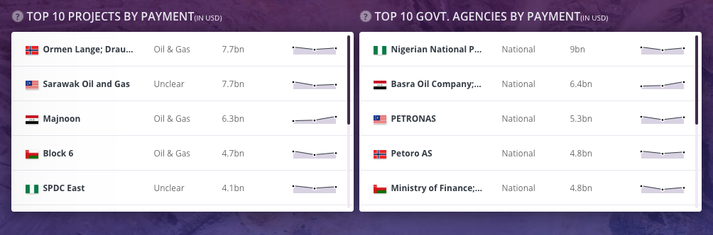
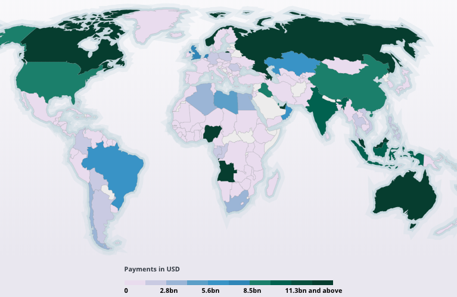
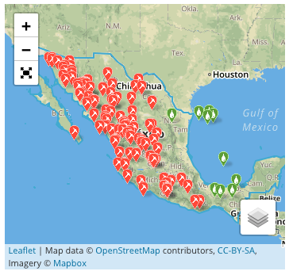

```{r, include=FALSE, message=FALSE}

#rmarkdown::render(input = "/Users/hsubhash/Documents/GitHub/RP Outreach/Blogs/Intro to RP/intro_rp.Rmd", output_dir = "/Users/hsubhash/Documents/GitHub/nrgi_reports/intro_rp")

rm(list = ls())
library(tint); library(tidyverse); library(googlesheets); library(lubridate); library(ggthemes)
# invalidate cache when the package version changes
knitr::opts_chunk$set(tidy = FALSE, cache.extra = packageVersion('tint'), fig.width = 4, fig.asp = 0.618, out.width = "95%")
options(htmltools.dir.version = FALSE)

suppressMessages(
    rawSources <- gs_title("Raw Data Dump") %>% 
        gs_read(ws = "Source", verbose = F)
)
suppressMessages(
    projectSecondary <- gs_title("Final Secondary - Project") %>% 
        gs_read(ws = "Data", verbose = F)
    
)

suppressMessages(
    entitySecondary <- gs_title("Final Secondary - Govt. Entities") %>% 
        gs_read(ws = "Data", verbose = F)
)

sourceData <- read_csv("/Users/hsubhash/Documents/GitHub/resource-project-data/Data Pipeline/All Data Backups/Current website data/allSource.csv")
projectData <- read_csv("/Users/hsubhash/Documents/GitHub/resource-project-data/Data Pipeline/All Data Backups/Current website data/allProject.csv")
entityData <- read_csv("/Users/hsubhash/Documents/GitHub/resource-project-data/Data Pipeline/All Data Backups/Current website data/allEntity.csv")
```

```{r, fig.margin = TRUE, fig.cap = "Fig 1: Payments disclosed is increasing every year", cache=TRUE, echo=FALSE}
projectData %>%
    filter(reportYear != 2018) %>% 
    group_by(reportYear) %>% 
    summarise(totalPayments = sum(projectPayment)) %>% 
    ggplot(., aes(x = reportYear, y = (totalPayments/1e9))) +
    geom_line() +
    annotate(geom = "text", x = 2014, y = 125, label = "Payments (in billions of USD)", angle = "90", vjust = 1.1, size = 5) +
    annotate(geom = "text", x = 2017, y = 0, label = "Financial year", hjust = 0.8, vjust = -0.5, size = 5) +
    theme_fivethirtyeight()
# +
#     labs(y = str_wrap("Total payments", width = 24), 
#          x = "Financial year") +
#     theme_fivethirtyeight() + 
#     theme(
#         axis.title = element_text()
#     )


ggsave(filename = "fig1.png", path = "plots")
```

<!-- ```{r, fig.margin = TRUE, cache=TRUE, echo=FALSE} -->
<!--  -->
<!-- ``` -->


The latest version of <a href="https://resourceprojects.org/" target="_blank">resourceprojects.org</a> is now live, with several new features and data! 

<a href="https://resourceprojects.org/" target="_blank">resourceprojects.org</a> is the most complete and clean repository of project-level payments made by extractive sector companies around the world. The website contains information on USD `r round(max(c(sum(projectData$projectPayment, na.rm = T), sum(entityData$entityPayment, na.rm = T)))/1e9, 0)` billion in payments made by `r n_distinct(sourceData$reportingCompany)` extractive sector companies that have reported under mandatory disclosure laws passed in the European Union, Norway, and Canada since 2014. In addition to this payment data, you can now access profile pages for <a href="https://resourceprojects.org/company/BP%20Public%20Limited%20Company" target="_blank">companies</a> and <a href="https://resourceprojects.org/country/Brazil" target="_blank">countries</a>, subscribe to customized <a href="https://resourceprojects.org/subscribe" target="_blank">updates</a>, and submit <a href="https://resourceprojects.org/sources/add-source" target="_blank">new sources</a> to us for scraping.

`r margin_note("During the semi-automated <span class='highlight'>cleaning process</span> we translate everything into English, reconcile the names used for projects, payment types, countries, and government agencies, convert everything to USD, check for filing or scraping errors, remove duplicates and compile everything into a standard template.")`

`r newthought("Clean, complete and easy.")` The greatest asset of the website continues to be the data. Since 2016, we have scraped, <span class='highlight'>cleaned</span> and compiled over `r nrow(rawSources)` documents released in 21 different reporting jurisdictions with varying formats, reporting templates and languages. You can access the entire dataset and/or filter a specific cut of the data using the  <a href="https://resourceprojects.org/projects?tab=0&" target="_blank">payment tables</a> on the website.

`r margin_note("We collect <span class='highlight'>secondary data</span> on each extractive sector company that includes its [legal entity identifiers](https://www.gleif.org/en/), headquarters, stock tickers and website. We also show the locations of their projects and the commodity that is being extracted")`
`r newthought("Company profiles.")` Every company that has disclosed under mandatory disclosure laws now has a profile page. The profiles summarise payment data for each company and provide <span class='highlight'>secondary data</span> on their operations. You can access these profiles through the company profile landing page <a href="https://resourceprojects.org/company-profiles" target="_blank">here</a> or by clicking on a company name anywhere on the website.

```{r, echo=FALSE, fig.cap="Fig 2: Screenshot of tables showing the top projects and government agencies (by payment) for Royal Dutch Shell PLC"}

```

`r newthought("Country profiles.")` We have provided profiles for countries since mid-2017. This year we have made several performance improvements and made them easier to access. Click on a country you are interested in on the <a href="https://resourceprojects.org/country-profiles" target="_blank">landing page</a> map to access its profile.

```{r, echo=FALSE, fig.cap="Fig 3: Screenshot of the landing page map showing payments received by countries"}

```

`r margin_note("You will be notified whenever there is new data <span class='highlight'>relevant to your subscription</span>, at which point you can visit the website to explore it further. Click <a href='https://www.resourceprojects.org/admin/email/subscribe?id=5c50900d05ad43002364445f, target='_blank'>here</a> to view a sample newsletter.")`

`r newthought("Customized updates to track payments.")` If you are interested in following a particular country, company or reporting jurisdiction you can do so by <a href="https://resourceprojects.org/subscribe" target="_blank">signing up</a> on the website to receive <span class='highlight'>customized</span> updates based on your interests.

```{r, echo=FALSE, fig.margin = TRUE, fig.cap="Fig 4: Screenshot of a country profile map of projects in Mexico, showing the location and type of project"}

```

`r newthought("Submit new disclosure sources.")` Have we missed a mandatory disclosure report? Now you can tell us about it <a href="https://resourceprojects.org/sources/add-source" target="_blank">here</a>. We will scrape and upload data from it so that you can see it on the website. You can access the submit sources button by going to the table of mandatory disclosure sources <a href="https://resourceprojects.org/sources?tab=0&" target="_blank">here</a>.

```{r, fig.margin = TRUE, fig.cap = "Fig 5: Why are a high proportion of payments being disclosed through unidentifiable project names in Mexico?", cache=TRUE, echo=FALSE}
projectData %>% 
    left_join(., projectSecondary, by = c("projectCountry", "projectName")) %>% 
    filter(!is.na(projectType) & projectCountry == "Mexico")%>% 
    group_by(projectType) %>% 
    summarise(totalPayment = sum(projectPayment, na.rm = T)) %>% 
    ggplot(., aes(x = reorder(projectType, -totalPayment), y = round(totalPayment/1e6, 1))) +
    geom_col() +
    coord_flip() +
    theme_fivethirtyeight() +
    labs(y = "Payments (in millions of USD)") +
    theme(
        axis.title = element_text(size = 16),
        axis.text = element_text(size = 14),
        axis.title.y = element_blank()
    )
    
ggsave(filename = "fig5.png", path = "plots")
```

`r newthought("Secondary data.")` As mentioned earlier, in addition to payment (primary) data, we collect additional (secondary) data on projects, government agencies and companies. You can use this data for more detailed analysis of the payment data and check the quality of disclosures. 


```{r, fig.margin = TRUE, fig.cap = "Fig 6: Majority of payments made flow to national level government agencies", cache=TRUE, echo=FALSE}
left_join(entityData, entitySecondary, by = c("entityCountry", "entityName")) %>% 
    filter(!is.na(entityLevel)) %>% 
    group_by(entityLevel) %>% 
    summarise(totalPayment = sum(entityPayment, na.rm = T)) %>% 
    ggplot(., aes(x = reorder(entityLevel, -totalPayment), y = round(totalPayment/1e9, 1))) +
    geom_col() +
    coord_flip() +
    theme_fivethirtyeight() +
        labs(y = "Payments (in billions of USD)")  +
    theme(
        axis.title = element_text(size = 16),
        axis.text = element_text(size = 14),
        axis.title.y = element_blank()
    )
ggsave(filename = "fig6.png", path = "plots")
```

In addition to the project and government agency types, which can be used as a filter for the data on the website, we collect several other variables (commodity, location etc.). We are still in the process of finalizing this data and look forward to including it when we launch the next iteration of the website. In the meantime, please <a href="mailto:admin@resourceprojects.org">email us</a> if you are interested in using this data for your work. 

`r newthought("Persistent provenance.")` We noticed that over time some (about 15% every year) urls or APIs that are used to host mandatory disclosure reports either disappear or get replaced. In order to maintain full traceability between raw and final versions of the data we now provide access to a backup for every report. This way you will always be able to read the original report irrespective of whether it is available online at source. You can access both version of sources through the table of mandatory disclosure sources <a href="https://resourceprojects.org/sources?tab=0&" target="_blank">here</a>.

`r newthought("Please give us feedback!!!")` We are excited for you to try out these new features. The website continues to be in active development and we would love to have your inputs on any additional features you would like or any bugs you notice. Please provide feedback <a href="https://docs.google.com/spreadsheets/d/1fUd3aCEfVzb1zqQo1MF6mpQG4y7R_6Xpkaov8FKaIyw/edit?usp=sharing" target="_blank">here</a>.

`r newthought("A big thanks")` to our developers <a href="http://younginnovations.com.np/" target="_blank">Young Innovations</a> for their work on this project. They are a pleasure to work with and have done an excellent job at translating our vision into an easy to use and intuitive website.
