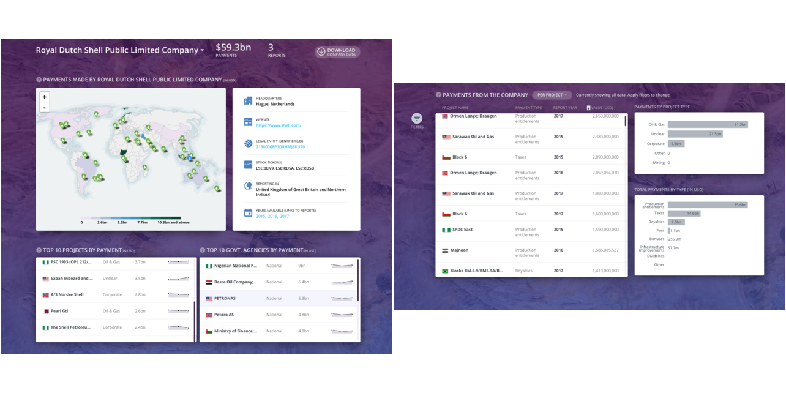

```{r, include=FALSE, message=FALSE}
rm(list = ls())
library(tint); library(tidyverse); library(googlesheets); library(lubridate); library(ggthemes)
# invalidate cache when the package version changes
knitr::opts_chunk$set(tidy = FALSE, cache.extra = packageVersion('tint'), fig.width = 4, fig.asp = 0.618, out.width = "95%")
options(htmltools.dir.version = FALSE)

suppressMessages(
    rawSources <- gs_title("Raw Data Dump") %>% 
        gs_read(ws = "Source", verbose = F)
    
)

sourceData <- read_csv("/Users/hsubhash/Documents/GitHub/resource-project-data/Data Pipeline/All Data Backups/Current website data/allSource.csv")
projectData <- read_csv("/Users/hsubhash/Documents/GitHub/resource-project-data/Data Pipeline/All Data Backups/Current website data/allProject.csv")
entityData <- read_csv("/Users/hsubhash/Documents/GitHub/resource-project-data/Data Pipeline/All Data Backups/Current website data/allEntity.csv")
```


A new version of <a href="https://resourceprojects.org/" target="_blank">resourceprojects.org</a> is available with exciting new features! In addition to payment data, the website now provides profile pages for companies and countries that showcase customized information and data on these.`r margin_note('<span class="highlight">Subscribe</span> <a href="https://resourceprojects.org/" target="_blank">here</a> and we will notify you whenever there is new data relevant to a country, company or reporting jurisdiction you are interested in tracking.')` We have also added options to <span class='highlight'>subscribe</span> to regular updates. Finally, users can now add any new sources with mandatory disclosure data that we have missed out on through the website. This will sent to us for scraping and adding to the website.

`r newthought("Comprehensive, clean and easy.")` Our greatest asset is our data. `r margin_note("During the automated <span class='highlight'>cleaning process</span> we reconcile the names used for projects, payment types, countries, and government agencies, convert everything to USD, check for filing or scraping errors, and remove duplicates.")`Since 2016, we have scraped over `r nrow(rawSources)` documents released in 21 different reporting jurisdictions with varying formats, reporting templates and languages. These reports were translated into english (when necessary), and <span class='highlight'>cleaned</span> and compiled into a standard template. All this makes project level data super easy to access, use and analyze. 

```{r fig-margin, fig.margin = TRUE, fig.cap = "Total payments disclosed by financial year", cache=TRUE, echo=FALSE}
projectData %>%
    group_by(reportYear) %>% 
    summarise(totalPayments = sum(projectPayment)) %>% 
    ggplot(., aes(x = reportYear, y = (totalPayments/1e9))) +
    geom_line() +
    labs(x = "Years", y = str_wrap("Total payments in billions of USD", width = 28)) +
    theme_fivethirtyeight() + 
    theme(
        axis.title = element_text(),
        axis.title.x = element_blank()
    )
```

As a result, <a href="https://resourceprojects.org/" target="_blank">resourceprojects.org</a> is today the most comprehensive and clean source of project level payments in the world. It contains information on `r round(max(c(sum(projectData$projectPayment, na.rm = T), sum(entityData$entityPayment, na.rm = T)))/1e9, 0)` billion USD in payments made by extractive sector companies that have reported under the mandatory disclosure laws in European Union, Norway and Canada since 2014. <a href="https://resourceprojects.org/" target="_blank">Payment tables</a> give access to this clean and standarized payment data. Users interested in a specific cut of the data can also use the extensive filtering features to narrow down to the specific parts of the data that you may be most interested in.

`r newthought("Company profile pages.")` Every company that has disclosed under mandatory disclosure laws now has a profile page. `r margin_note("We collect <span class='highlight'>additional information</span> on each extractive sector company that includes its [legal entity identifiers](https://www.gleif.org/en/), headquarters, stock tickers and website. We also show the locations of their projects and the commodity that is being extracted")` These pages summarise payment data scraped from disclosure reports and provide <span class='highlight'>additional information</span> on their operations. You can access these through the company profile landing page here or by clicking on a company name anywhere on the website.

```{r, fig.fullwidth = TRUE, echo=FALSE}

```


`r newthought("Country profile pages.")`


`r newthought("Company profile pages.")`
`r newthought("Company profile pages.")`

`r newthought("Company profile pages.")`

We are also beginning to use additional data that we have collected on projects and government agencies.asfasdf

##How easy it is to scrape
Speed with which new data is added
